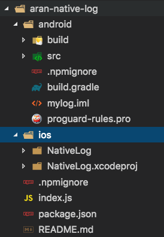

## Android原生模块封装

###[Demo](https://github.com/naivehhr/aran_native_log)

### ref:

[1](http://www.jianshu.com/p/73ef53244a7b) [2](http://www.jianshu.com/p/07b928feee3b) [3](http://www.liuchungui.com/blog/2016/05/08/reactnativezhi-yuan-sheng-mo-kuai-kai-fa-bing-fa-bu-androidpian/)

### ps: 还是得自己过坑😭

- 1、用Android Studio打开创建RN项目中的Android项目(比如成为A)

- 2、在A的根目录中新建一个Module(右键或者File -> New -> New Module)，这里称为BModule

- 3、在B中添加自己要封装的模块比如Toast的实现

- 4、B中的依赖要和母RN项目一致或不要过高(有警告)

- 5、引用的话就直接react-native link

> ### 注意：
> 封装组件时候尽量保持如下目录(图1); 引用时候路径

```
include ':aran-native-log'
project(':aran-native-log').projectDir = new File(rootProject.projectDir, '../node_modules/aran-native-log/android')

```


图一

### TODO

> 更多原生事件等