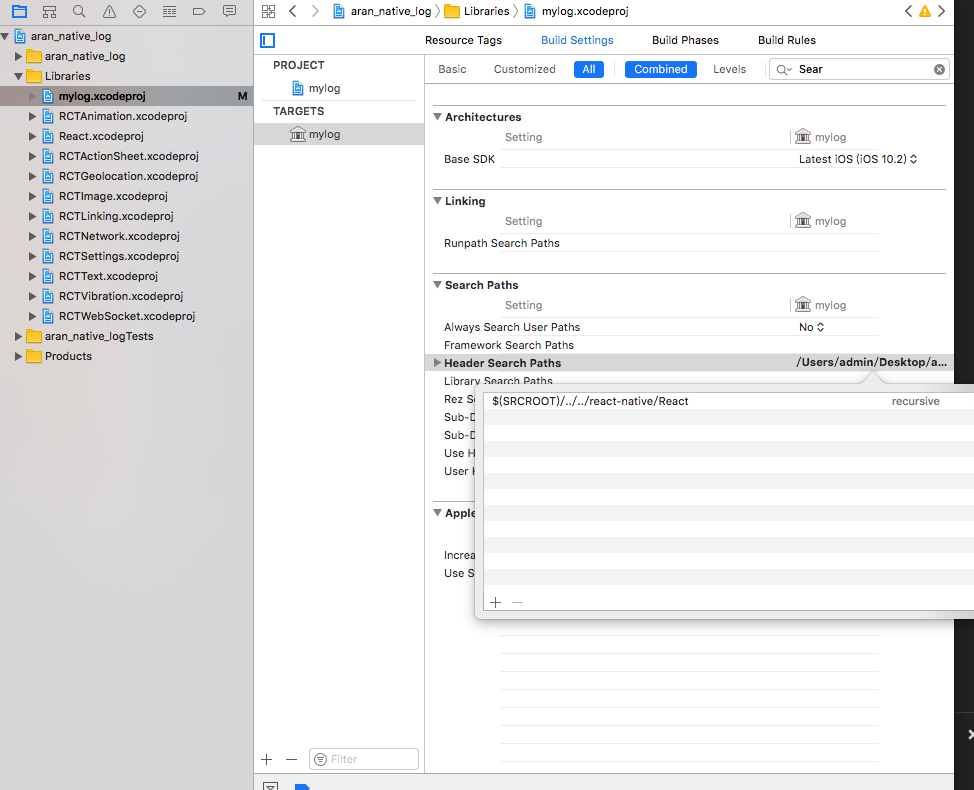

## IOS 原生模块封装


###[Demo](https://github.com/naivehhr/aran_native_log)

### ps: 还是得自己过坑😭

- 1、创建一个用来调试模块的RN项目

- 2、在项目的node_module目录下创存放组件的目录比如A

- 3、XCODE打开RN项目中的IOS项目, 完成原生模块的封装及测试

- 4、封装完成后, 使用XCODE在目录A中创建静态库项目(模块名称最好和上面调试模块的名称一致)

- 5、把RN->IOS项目中封装模块的代码.h.m拷贝到静态库文件中

- 6、设置静态库项目的header search path路径(添加React的依赖)

```
Build Settings->Header Search Patchs->$(SRCROOT)/../../react-native/React -> recursive

```

### 注意：
- 1 如果是别人的库，按照要求添加应该就OK
- 2 自己开发的库如果出现找不到React相关依赖时，查看引用路径，或组件导出输出路径是否正确(90%是这的问题)
- 3 可直接在依赖静态库中更改Search Paths




### TODO

> 更多原生事件等